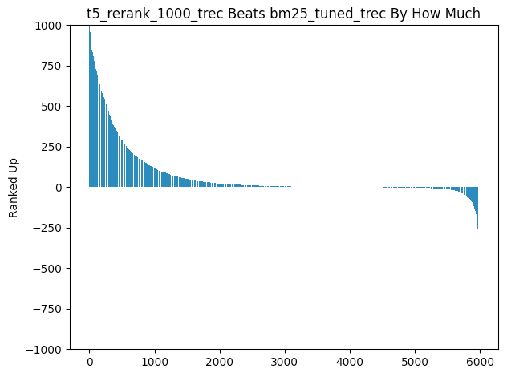

# GPT_Ranker

This Repo Is For MSMARCO Document/Passage Reranking Task Using GPT-2/T5 Model
- - -

## Related Links

### Dataset

- [MS MARCO Home Page](https://microsoft.github.io/msmarco/)
- [Passage Ranking Git Repo](https://github.com/microsoft/MSMARCO-Passage-Ranking)
- [Document Ranking Git Repo](https://github.com/microsoft/MSMARCO-Document-Ranking)
- [Jimmy Lin Anserini Passage Retrieval](https://github.com/castorini/anserini/blob/master/docs/experiments-msmarco-passage.md)
- [Jimmy Lin Anserini Document Retrieval](https://github.com/castorini/anserini/blob/master/docs/experiments-msmarco-doc.md)
- [TREC 2020 Deep Learning Task](https://microsoft.github.io/TREC-2020-Deep-Learning/)

### Models

- [castorini docTTTTTquery](https://github.com/castorini/docTTTTTquery#ms-marco-document-dataset)
- [Google T5](https://github.com/google-research/text-to-text-transfer-transformer)
- [OpenAI GPT-2](https://github.com/openai/gpt-2)
- [Hugging Face Framework](https://github.com/huggingface/transformers)

### Traditional Models

- [Query Likelihood Language Model](https://en.wikipedia.org/wiki/Query_likelihood_model)

### Tools

- [Google Cloud TPU](https://cloud.google.com/tpu/docs/quickstart)

- - -
## To Clone this repo

```
git clone --recursive-submodules git@github.com:ielab/GPT_Ranker.git
```

- - -
## The Recall/MRR@10 evaluation for msmarco doc dev (5193 queries)

|         |        |Recall   | MRR@100   |
| :--:    | :---:  |:-----:  | :-----:   |
| T5-Base | Top 100|
|         |Top 200 |
|         |Top 500 |
|         |Top 1000|
| GPT-2   |Top 100 |
|         |Top 200 |
|         |Top 500 |
|         |Top 1000|
|BM25 Initial Retrieval |        | `recall_5 all 0.4024`<br/>`recall_10 all 0.4946`<br/>`recall_15 all 0.5640`<br/>`recall_20 all 0.6095`<br/>`recall_30 all 0.6649`<br/>`recall_100 all 0.7874`<br/>`recall_200 all 0.8373`<br/>`recall_500 all 0.8850`<br/>`recall_1000 all 0.9187` | `0.27880910`
|MS MARCO Top 1000      |        |       |

- - -
## The Recall/MRR@10 evaluation for msmarco passage dev small (6980 queries)

|         |        |Recall   | MRR@10   |
| :--:    | :---:  |:-----:  | :-----:  |
| T5-Base |Top 100 | `recall_5 all 0.4294`<br/>`recall_10 all 0.5321`<br/>`recall_15 all 0.5778`<br/>`recall_20 all 0.6076`<br/>`recall_30 all 0.6354`<br/>`recall_100 all 0.6701`<br/>`recall_200 all 0.6701`<br/>`recall_500 all 0.6701`<br/>`recall_1000 all 0.6701` | `0.28134977`
|         | Top 200| `recall_5 all 0.4413`<br/>`recall_10 all 0.5496`<br/>`recall_15 all 0.6037`<br/>`recall_20 all 0.6371`<br/>`recall_30 all 0.6719`<br/>`recall_100 all 0.7333`<br/>`recall_200 all 0.7383`<br/>`recall_500 all 0.7383`<br/>`recall_1000 all 0.7383` | `0.286065970`
|         | Top 500| `recall_5 all 0.4502`<br/>`recall_10 all 0.5630`<br/>`recall_15 all 0.6195`<br/>`recall_20 all 0.6561`<br/>`recall_30 all 0.6987`<br/>`recall_100 all 0.7812`<br/>`recall_200 all 0.8040`<br/>`recall_500 all 0.8116`<br/>`recall_1000 all 0.8116` | `0.2904781`
|         |Top 1000| `recall_5 all 0.4553`<br/>`recall_10 all 0.5708`<br/>`recall_15 all 0.6318`<br/>`recall_20 all 0.6700`<br/>`recall_30 all 0.7148`<br/>`recall_100 all 0.8093`<br/>`recall_200 all 0.8390`<br/>`recall_500 all 0.8553`<br/>`recall_1000 all 0.8573` | `0.2920570`
| GPT-2   |Top 100 |
|         |Top 200 |
|         |Top 500 |
|         |Top 1000|
|BM25 Initial Retrieval |        | `recall_5 all 0.2944`<br/>`recall_10 all 0.3916`<br/>`recall_15 all 0.4459`<br/>`recall_20 all 0.4842`<br/>`recall_30 all 0.5307`<br/>`recall_100 all 0.6701`<br/>`recall_200 all 0.7383`<br/>`recall_500 all 0.8116`<br/>`recall_1000 all 0.8573` | `0.187412`
|MS MARCO Top 1000      |        | `recall_5 all 0.0093`<br/>`recall_10 all 0.0150`<br/>`recall_15 all 0.0196`<br/>`recall_20 all 0.0224`<br/>`recall_30 all 0.0270`<br/>`recall_100 all 0.1026`<br/>`recall_200 all 0.1641`<br/>`recall_500 all 0.3893`<br/>`recall_1000 all 0.8140` |  `0.00456946`

## For example in passage task:

Our model ranks this at top 1:
```
{"id": "7485889", "contents": "How many tables can I have in 1 Sql Azure Database. I know in Sql Server, Tables per database Limited by number of objects in a database, Database objects include objects such as tables, views, stored procedures, user-defined functions, triggers, rules, defaults, and constraints. The sum of the number of all objects in a database cannot exceed 2,147,483,647.."}
```

The actual relevant document is (we rank this at 949, BM25 rank this at 300):
```
{"id": "7485894", "contents": "SQL JOIN. A JOIN clause is used to combine rows from two or more tables, based on a related column between them. Let's look at a selection from the Orders table: Then, look at a selection from the Customers table: Notice that the CustomerID column in the Orders table refers to the CustomerID in the Customers table. The relationship between the two tables above is the CustomerID column. Then, we can create the following SQL statement (that contains an INNER JOIN), that selects records that have matching values in both tables: Example SELECT Orders.OrderID, Customers.CustomerName, Orders.OrderDate"}
```

Comparison with BM25 model:



- - -
## File Structure

__*The file structure should be same as this*:__

```
GPT_Ranker/
+--- anserini/
+--- data/
|    +--- doc_rerank/
|    |    +--- collection_jsonl/
|    |    |    +--- docs00.json
|    |    |    +--- docs01.json
|    |    |    +--- docs02.json
|    |    |    +--- docs03.json
|    |    |    +--- docs04.json
|    |    |    +--- docs05.json
|    |    |    +--- docs06.json
|    |    +--- index/
|    |    |    +--- lucene-index.msmarco-doc.pos+docvectors+rawdocs/
|    |    |    |    +--- HERE CONTAINS THE ANSERINI MSMARCO DOCUMENT INDEX
|    |    +--- qrels/
|    |    |    +--- qrels.msmarco-doc.dev.txt
|    |    +--- query/
|    |    |    +--- doc-msmarco-dev-queries.json
|    |    |    +--- doc-msmarco-test2020-queries.json
|    |    +--- formatted_run.msmarco-doc.dev.bm25.tuned.txt
|    |    +--- formatted_run.msmarco-doc.test.bm25.tuned.txt
|    +--- pass_rerank
|    |    +--- collection_jsonl/
|    |    |    +--- docs00.json
|    |    |    +--- docs01.json
|    |    |    +--- docs02.json
|    |    |    +--- docs03.json
|    |    |    +--- docs04.json
|    |    |    +--- docs05.json
|    |    |    +--- docs06.json
|    |    |    +--- docs07.json
|    |    |    +--- docs08.json
|    |    +--- index/
|    |    |    +--- lucene-index-msmarco/
|    |    |    |    +--- HERE CONTAINS THE ANSERINI MSMARCO PASSAGE INDEX
|    |    +--- qrels/
|    |    |    +--- qrels.dev.small.tsv
|    |    |    +--- pass-qrels.msmarco-dev.full.txt
|    |    +--- query/
|    |    |    +--- pass-queries.dev.json
|    |    |    +--- pass-queries.eval.json
|    |    |    +--- pass-query-dev.small.json
|    |    +--- run.msmarco-passage.dev.small.tsv
|    |    +--- run.msmarco-passage.dev.full.tsv
|    |    +--- run.msmarco-passage.dev.eval.tsv
|    +--- pass_train/
|    |    +--- doc_query_pairs.train.tsv
|    +--- doc_train/
|    |    +--- doc_query_pairs.train.tsv
+--- logs/
|    +--- gpt2/
|    |    +--- CONTAIN GPT2 TRAINING LOGS
|    +--- t5/
|    |    +--- CONTAIN T5 TRAINING LOGS
+--- model/
|    +--- gpt-2/
|    |    +--- CONTAIN PRETRAINED GPT-2 (UNTUNED)
|    +--- t5-base/
|    |    +--- CONTAIN T5 FINE TUNED ON MSMARCO PASSAGE
|    +--- t5-base-tuned/
|    |    +--- tuned_on_doc/
|    |    |    +--- CONTAIN T5 FINE TUNED ON MSMARCO DOCUMENT
|    +--- gpt-2-tuned/
|    |    +--- tuned_on_pass/
|    |    |    +--- CONTAIN GPT-2 FINE TUNED ON MSMARCO PASSAGE
|    |    +--- tuned_on_doc/
|    |    |    +--- CONTAIN GPT-2 FINE TUNED ON MSMARCO DOCUMENT
+--- result/
|    +--- doc_rerank/
|    |    +--- gpt2/
|    |    +--- t5/
|    +--- pass_rerank/
|    |    +--- gpt2/
|    |    +--- t5/
+--- notes/
+--- config.json
+--- fine_tuning.py
+--- helper.py
+--- main.py
+--- middleware.py
+--- passage_msmarco_eval.py
+--- doc_msmarco_eval.py
+--- ranker.py
+--- anserini_retriever.py
+--- README.md
+--- SOME OTHER FILES
```
