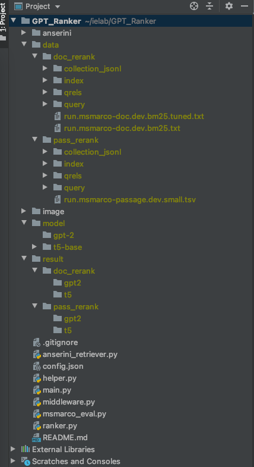

# GPT_Ranker

This Branch Is For MSMARCO Passage Reranking Task Using GPT-2 Model

## TREC CAsT Datasets

- MS MARCO: https://microsoft.github.io/msmarco/  
  - Git Repo: https://github.com/microsoft/MSMARCO-Passage-Ranking
- TREC CAR: http://trec-car.cs.unh.edu/datareleases/v2.0-release.html
- castorini docTTTTTquery: https://github.com/castorini/docTTTTTquery#ms-marco-document-dataset

## To Clone this repo

git clone --recursive-submodules git@github.com:ielab/GPT_Ranker.git

## Branches

- `master`: For MSMARCO Passage Reranking Task Using GPT-2
- `document_reranking`: For MSMARCO Document Reranking Task Using GPT-2
- `doc2query`: For MSMARCO Passage Reranking Task Using docTTTTTquery
- `doc2query-doc`: For MSMARCO Document Reranking Task Using docTTTTTquery

## File Structure

_The file structure should be same as this_

